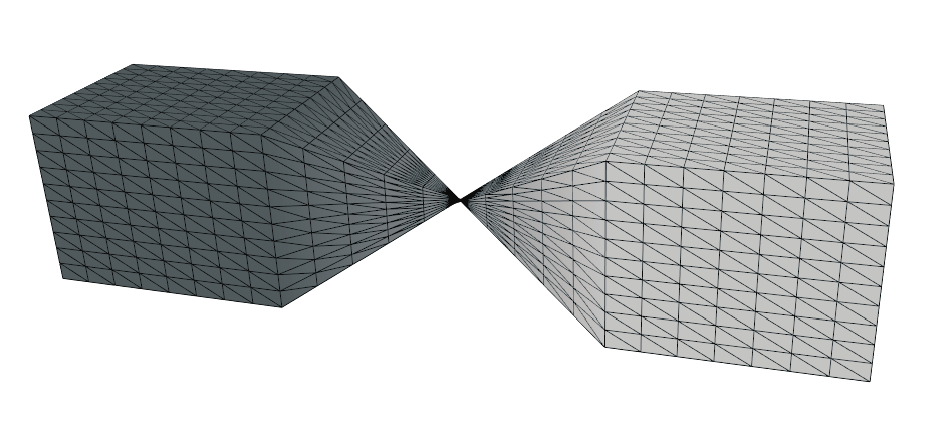
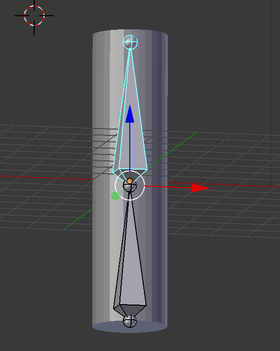
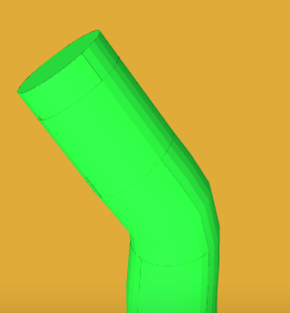
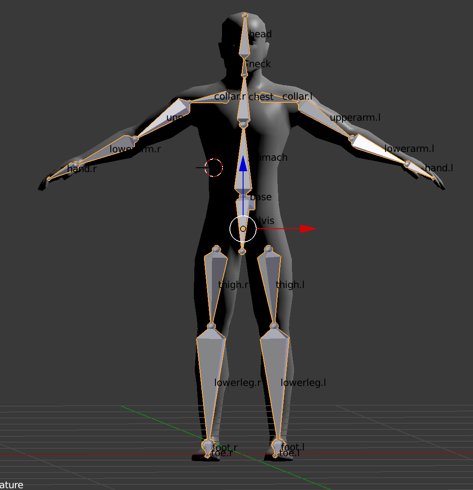
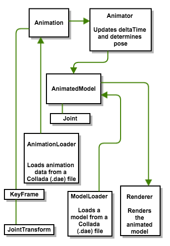

# Dual Quaternion Skinning
Skeletal Animation with Dual Quaternion Skinning and Linear Blend Skinning
# Abstract
Skinning refers to an animation technique where a model is animated
using a skeleton (primarily when a vertex may be influenced by more than
one bone). The Process of creating a hierarchical set of interconnected
bones called skeleton or a rig is called Rigging.

For real-time animation of deformable models, skinning is an important
aspect to give the look and feel of a real character to the model. The
standard method that is used for skinning is the Linear Blend Skinning,
although it is very simple and effective in most cases, there are cases
where it produces errors like loss of volume, candy wrapper artifacts
and unrealistic looking edges. To solve these problems, we can use an
enhanced version of skinning method called Dual Quaternion skinning
which is not too complex as related to Linear Blend skinning but
produces much better results.

Introduction
============

In some of the animation applications we need to have very accurate skin
mapping and manipulation, but in some other applications like video
games, a fast algorithm is needed for skinning multiple models rapidly
which is the reason for devoting our time to Dual Quaternion skinning. I
will be implenting Dual quaternion skinning in this project and will be
applying it to deform one of the human models and try to improve on its
efficiency.

Benefits of Dual quaternion skinning includes that it is not as complex
as more advanced skinning methods, almost as efficient as LBS and the
same environment as used for LBS can be used.

Literature Review
=================

There has been much work done in this field, although people have
employed different methods to solve this problem , the major umbrellas
that these techniques fall under include : physically based models,
capturing real subsets, example based techniques and Geometric methods.

The technique I will be employing : Dual Quaternion Skinning, falls
under Geometric methods and I will be following a paper by Ladislav
Kavan et.al called “Skinning with Dual Quaternions”.

Understanding Dual Quaternions
==============================

Dual Quaternion mathematics is similar to normal Quaternions but it is
different from them because dual quaternions contains two quaternion one
which is simple and the other considered as dual part.

{width="40.00000%"}

They can represent both translation and rotation at the same time and
hence a complete Rigid body transformation can be represented by a Dual
Quaternion

Method
======

I will first try to implement Linear blend skinning and see its results
and limitations. When I am done, I will improve my method to implement
Dual Quaternion skinning. I am planning to further split this whole
process into phases as well, ie , firstly I will try to implement
skinning on a basic primitive object, then extend it to cover a very
basic human model and then move on to a complex model.

Rigging
-------

I will first have to create a skeleton or bone model for the model and
assign weights to individual parts of the body, and then only I can
apply the skinning process by blending the skin texture with respect to
the bone/joint being moved.

Data Structures and algorithms
------------------------------

We will use mathematical objects called Dual Quaternions instead of
using matrices to express the motions of the joints. With Quaternions we
can express 3D rotations as we would do with a 3x3 matrix and with Dual
Quaternions we can express a rotation and a translation like a 4x4
matrix.

Skinning process
----------------

Convert all the transformation matrices (4X4) of the bones/joints
representing both rotation and transformation to dual quaternions. I did
this on the CPU and sent them to GPU in 4x4 matrices using just the
first 2 rows. Then we can compute the deformed position of a vertex with
DQS by this formula:

{width="40.00000%"}

I calculated these values for vertices and normals in the vertex shader.

Tasks Done
==========

Learn about Rigging
-------------------

I started learning about rigging first and tried out various tools for
it, I started with Maya , moved on to Unity and finally tried Blender
and found that blender was the most user friendly and easy to use. Hence
I used Blender to implement rigging.

Selecting the tool for implementation
-------------------------------------

I tried to implement DQS on blender, maya and unity and I was able to
use DQS but most of the work was done by the software itself and it was
difficult to tweak the internal working and there was a learning curve
involved. Hence I decided to stick to the basics and used openGL for my
implementation where most the skinning computations were performed on
the GPU using shaders. I used Java OpenGL for the project.

Rigging a basic cylinder
------------------------

Since complete skinning is a complex process, I thought of starting with
a basic cylinder and then extending upon it. I created a basic 3D
cylinder in blender and started attaching armatures and bones to it, to
rig it as shown in figure 5.

{width="50.00000%"}

Applying Linear Blend Skinning on a basic cylinder
--------------------------------------------------

I created the basic building blocks of my openGL implementation with
parts to handle the world and the camera visualizations and started
working on implementing Linear Blend Skinning. Implementing LBS on the
GPU (shaders) was not that hard and I was easily able to to that as
shown in figure 6.

{width="50.00000%"}

Applying Dual Quaternion on a basic cylinder
--------------------------------------------

Implementing DQS was very tough and I took many days to figure out the
whole algorithm. I was finally able to implemented it and its working
almost correctly. I need to make some changes to the shader code for DQS
to make it better but I am leaving that for later as I want to move to
the next step since I am already lagging behind as per my original
schedule.

Rigging a complex model
-----------------------

I used blender to rig my model and played around with the bones to
produce a keyframe animation and finally exported it to a collada(.dae)
format to be used up by my program. The model that I rigged in blender
is shown with all the bones and their heirarchy in figure 7.

{width="50.00000%"}

Project Structure
=================

I used Java’s OpenGL implementation to implement my project. A Collada
parser was used to parse models and its animations from a collada(.dae
file) to be used up in the project.The names and brief introduction of
most of the moving parts in the project is shown in figure.

{width="50.00000%"}

Timeline
========

  **Phase**                       **Deadline**     **Status**
  ------------------------------- ---------------- ------------
  Implement LBS on a primitive    March 8, 2017    Done
  Extend LBS on a basic model     March 15, 2017   Done
  Rig a complex model             March 30, 2017   Done
  Extend DQS on a complex model   April 5, 2017    Done
  Try to improve the efficiency   April 10, 2017   Done

Conclusions
===========

I have implemented both LBS and DQS in Java’s OpenGL implementation. The
basic cylinder skinned using DQS did not exhibit candy wrapper issue
when rotated from the middle as it were portrayed by the cylinder
skinned using LBS.

Also for the human figure skinned using DQS, there was an axis change in
the final rigged model, ie, whatever was translated in Y-axis in the
rigging software(blender here) started translating in the Z-axis or vice
versa after feeding the exported animation to my skinning program. On
further investigation, I found that this was happening due to the fact
that I am exporting my .DAE file from blender and blender switches the
axis Y and axis Z as compared to some of the other industry standards. I
was not able to find a way to stop blender from doing this while the
export.

[^1]: e-mail:ishmeet@uvic.ca

